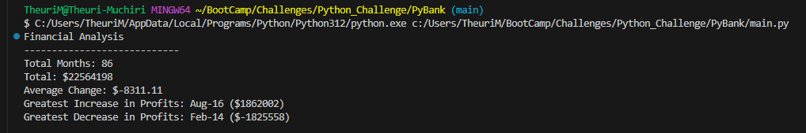

# Python_Challenge

## PyBank
 This Python script is to analyze the financial records of a company. The given financial dataset called budget_data.csv is composed of two columns: "Date" and "Profit/Losses".
 The Python script that analyzes the records to calculate each of the following values:

The total number of months included in the budget dataset

The net total amount of "Profit/Losses" over the entire period

The changes in "Profit/Losses" over the entire period, and then the average of those changes

The greatest increase in profits (date and amount) over the entire period

The greatest decrease in profits (date and amount) over the entire period

Below is a screnshot of the results:

## PyPoll
This project is involved with helping a small, rural town modernize its vote-counting process.

It uses a set of poll data called election_data.csv. The dataset is composed of three columns: "Voter ID", "County", and "Candidate". My task is to create a Python script that analyzes the votes and calculates each of the following values:

The total number of votes cast

A complete list of candidates who received votes

The percentage of votes each candidate won

The total number of votes each candidate won

The winner of the election based on popular vote